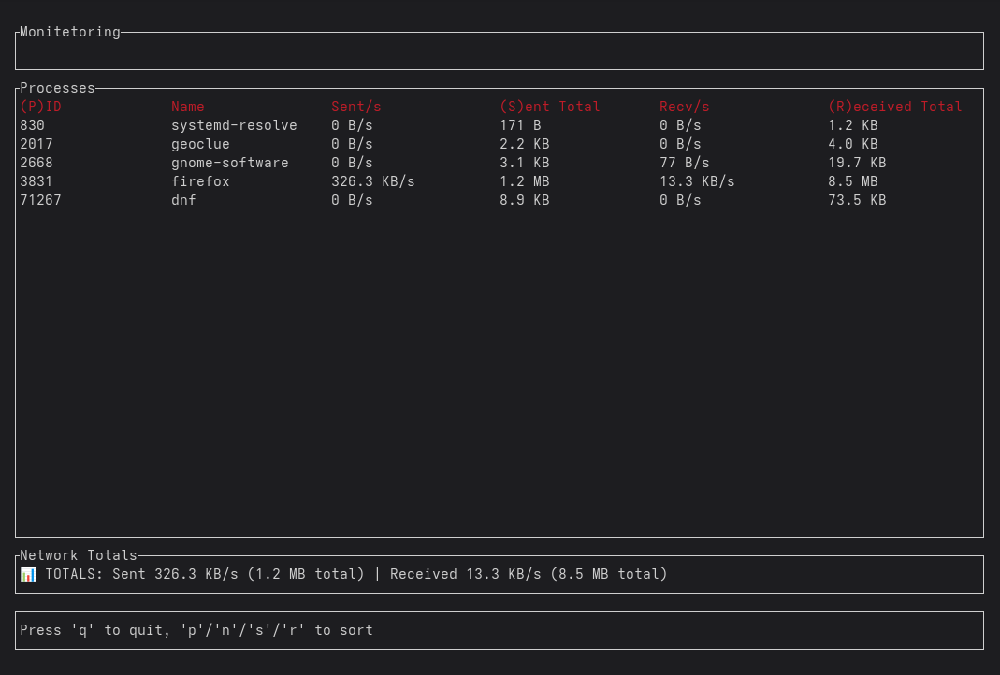

# Monitetoring

A real-time per-process network bandwidth monitoring tool for Linux, inspired by `nethogs`. Built with Rust and featuring a terminal UI powered by `ratatui`.

## Features

- Real-time monitoring of network bandwidth usage per process
- Container awareness for Docker, Podman, LXC, containerd, and systemd-nspawn
- Interactive setup when run without arguments
- Configuration persistence between runs
- TUI interface or JSON output for scripting
- Sortable columns (PID, process name, sent/received bytes, container name)
- Human-readable bandwidth formatting (B, KB, MB, GB, TB)
- Network interface selection
- Works without configuration

## UI



## Installation

### Prerequisites

- Linux system (kernel 2.6+ recommended)
- Rust 1.70+ (for building from source)
- Root/sudo privileges (required for packet capture)

### From Source

```bash
git clone https://github.com/superapple8x/monitetoring
cd monitetoring
cargo build --release
sudo cp target/release/monitetoring /usr/local/bin/
```

### Manual Installation

After building from source, you can install system-wide:

```bash
# Build the project
cargo build --release

# Install to system (requires sudo)
sudo cp target/release/monitetoring /usr/local/bin/

# Or install to user directory (no sudo needed)
mkdir -p ~/.local/bin
cp target/release/monitetoring ~/.local/bin/
# Make sure ~/.local/bin is in your PATH
```

### Dependencies

The project uses these key dependencies:
- `pcap` - Packet capture
- `ratatui` - Terminal UI
- `tokio` - Async runtime
- `clap` - CLI parsing
- `procfs` - Process information
- `serde` - JSON serialization

## Quick Start

### Interactive Mode

Simply run without arguments for guided setup:

```bash
# From source (development)
sudo cargo run

# If installed system-wide
sudo monitetoring
```

This will:
1. Show available network interfaces
2. Let you choose monitoring mode (TUI or JSON)
3. Configure container awareness
4. Save your preferences for future use

### Direct Usage

```bash
# From source (development)
sudo cargo run -- --interface any
sudo cargo run -- --interface eth0 --json
sudo cargo run -- --interface eth0 --containers
sudo cargo run -- --reset

# If installed system-wide
sudo monitetoring --interface any
sudo monitetoring --interface eth0 --json
sudo monitetoring --interface eth0 --containers
sudo monitetoring --reset
```

## Command Line Options

```
Usage: monitetoring [OPTIONS]

Options:
  -i, --interface <INTERFACE>  Network interface to monitor [default: any]
  -j, --json                   Output in JSON format instead of TUI
  -c, --containers             Enable container detection and display
      --reset                  Reset saved configuration and exit
  -h, --help                   Print help
  -V, --version                Print version
```

## Terminal UI

The TUI interface provides:

- Process bandwidth usage updates every second
- Sortable columns via keyboard shortcuts
- Container information when enabled
- Human-readable bandwidth display

### Keyboard Controls

| Key | Action |
|-----|--------|
| `q` | Quit |
| `p` | Sort by PID |
| `n` | Sort by process name |
| `s` | Sort by bytes sent |
| `r` | Sort by bytes received |
| `c` | Sort by container name (when containers enabled) |


## JSON Output Mode

For integration with monitoring systems or scripts:

```bash
# From source (development)
sudo cargo run -- --interface eth0 --json --containers

# If installed system-wide
sudo monitetoring --interface eth0 --json --containers
```

```json
[
  {
    "pid": 1234,
    "name": "firefox",
    "sent_bytes": 2621440,
    "received_bytes": 15925248,
    "sent_formatted": "2.5 MB",
    "received_formatted": "15.2 MB",
    "container_name": null
  },
  {
    "pid": 5678,
    "name": "nginx",
    "sent_bytes": 876544,
    "received_bytes": 1258291,
    "sent_formatted": "856 KB",
    "received_formatted": "1.2 MB",
    "container_name": "webserver"
  }
]
```

## Container Support

Monitetoring can detect processes running in container runtimes:

- Docker
- Podman
- LXC
- containerd
- systemd-nspawn

Container detection reads `/proc/[PID]/cgroup` to identify container membership.

**Note**: Due to Docker's network namespace isolation, containerized processes may not show network traffic in the host's monitoring view. This is expected behavior - containers use separate network namespaces.

## Configuration

Monitetoring automatically saves your preferences to:
- Linux: `~/.config/monitetoring/config.json`

The configuration includes:
- Default network interface
- Output mode preference (TUI/JSON)
- Container detection setting

Reset configuration:
```bash
# From source (development)
sudo cargo run -- --reset

# If installed system-wide
sudo monitetoring --reset
```

## Technical Details

### Architecture

- Hybrid async/threaded design with dedicated packet capture thread
- Modular structure separating capture, processing, and display
- Linux-focused implementation

### Network Monitoring

- Uses `libpcap` for packet capture
- Parses TCP/UDP packets to extract process information
- Maps network sockets to processes via `/proc/net/{tcp,udp}`
- Tracks per-process bandwidth in real-time

## Contributing

Contributions are welcome. Areas for improvement:

- Additional container runtime support
- Windows/macOS compatibility
- Performance optimizations
- Additional output formats
- Enhanced filtering options

## License

This project is licensed under the MIT License - see the [LICENSE](LICENSE) file for details.

## Acknowledgments

- Inspired by `nethogs`
- Built with Rust
- UI powered by `ratatui`

## Issues & Support

If you encounter any issues:

1. Ensure you're running with sudo/root privileges
2. Check that your network interface exists and is active
3. Verify container runtime is properly configured (if using --containers)
4. Check the logs for any error messages

For bug reports and feature requests, please use the GitHub issue tracker. 