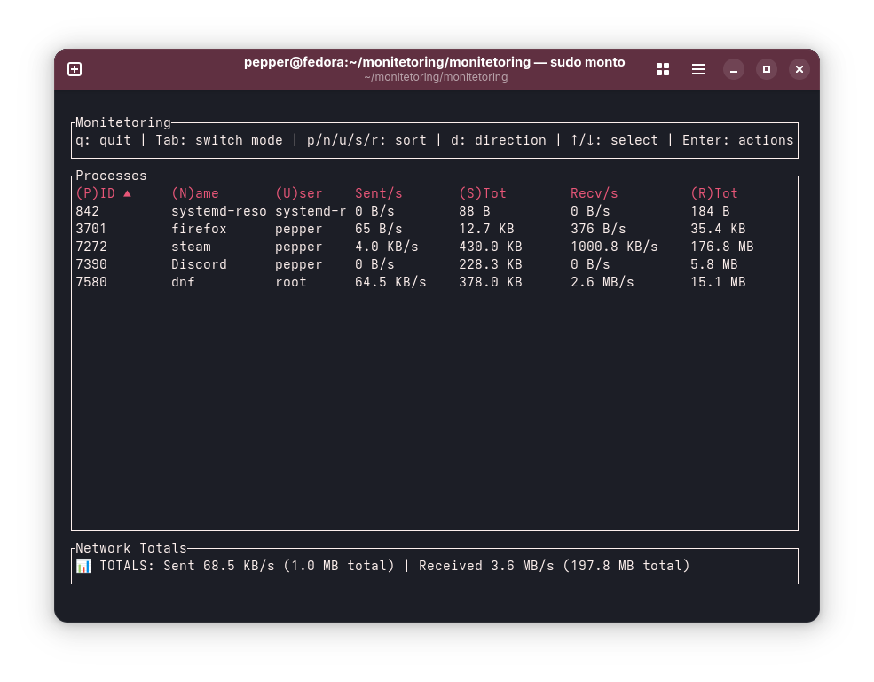
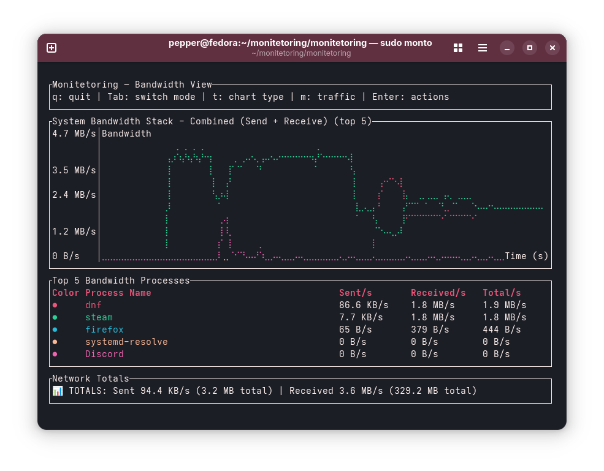

# Monitetoring

A real-time per-process network bandwidth monitoring tool for Linux, inspired by `nethogs`. Built with Rust and featuring a terminal UI powered by `ratatui`.

## Installation

### Prerequisites

- Linux system (kernel 2.6+ recommended)
- Rust tool-chain (stable)
- Root/sudo privileges (required for packet capture)

### Installing Rust

If you don't have Rust installed, run **one** of the following snippets:

#### Ubuntu / Debian

```bash
sudo apt update
sudo apt install -y curl build-essential pkg-config libssl-dev
curl --proto '=https' --tlsv1.2 -sSf https://sh.rustup.rs | sh -s -- -y
source "$HOME/.cargo/env"
```

#### Fedora / RHEL / CentOS

```bash
sudo dnf install -y curl pkg-config openssl-devel
curl --proto '=https' --tlsv1.2 -sSf https://sh.rustup.rs | sh -s -- -y
source "$HOME/.cargo/env"
```

After installation re-open your terminal or run `source $HOME/.cargo/env` so that `cargo` is available in your `PATH`.

### Quick Install (Recommended)

Once you have Rust installed, the easiest way to install monitetoring is via cargo:

```bash
cargo install monitetoring
```

This will download, compile, and install the latest version from [crates.io](https://crates.io/crates/monitetoring).

### Alternative Installation Methods

#### From Source

```bash
git clone https://github.com/superapple8x/monitetoring
cd monitetoring
cargo build --release
sudo cp target/release/monitetoring /usr/local/bin/

# Optional: Create the shorter 'monto' alias
sudo ln -s /usr/local/bin/monitetoring /usr/local/bin/monto
```

#### Manual Installation

After building from source, you can install system-wide:

```bash
# Build the project
cargo build --release

# Install to system (requires sudo)
sudo cp target/release/monitetoring /usr/local/bin/
# Optional: Create the shorter 'monto' alias
sudo ln -s /usr/local/bin/monitetoring /usr/local/bin/monto

# Or install to user directory (no sudo needed)
mkdir -p ~/.local/bin
cp target/release/monitetoring ~/.local/bin/
# Optional: Create the shorter 'monto' alias
ln -s ~/.local/bin/monitetoring ~/.local/bin/monto
# Make sure ~/.local/bin is in your PATH
```

### Dependencies

The project uses these key dependencies:
- `pcap` - Packet capture
- `ratatui` - Terminal UI
- `tokio` - Async runtime
- `clap` - CLI parsing
- `procfs` - Process information
- `serde` - JSON serialization

## Quick Start

### Interactive Mode

Simply run without arguments for guided setup:

```bash
sudo monitetoring
```

This will:
1. Show available network interfaces
2. Let you choose monitoring mode (TUI or JSON)
3. Configure container awareness
4. Save your preferences for future use

### Direct Usage

```bash
sudo monitetoring --interface any
sudo monitetoring --interface eth0 --json
sudo monitetoring --interface eth0 --containers
sudo monitetoring --reset
```

## Features

- Real-time monitoring of network bandwidth usage per process
- Container awareness for Docker, Podman, LXC, containerd, and systemd-nspawn
- Interactive setup when run without arguments
- Configuration persistence between runs
- TUI interface or JSON output for scripting
- Sortable columns (PID, process name, sent/received bytes, container name, user name)
- Human-readable bandwidth formatting (B, KB, MB, GB, TB)
- Network interface selection
- Works out of the box – configuration is purely optional

## Screenshots

**Main View**



**Bandwidth – System Stack**



**Bandwidth – Process Lines**


**System Overview**


## Command Line Options

```
Usage: monitetoring [OPTIONS]

Options:
  -i, --interface <INTERFACE>  Network interface to monitor [default: any]
  -j, --json                   Output in JSON format instead of TUI
  -c, --containers             Enable container detection and display
      --reset                  Reset saved configuration and exit
  -h, --help                   Print help
  -V, --version                Print version
```

## Terminal UI

The TUI interface provides:

- Process bandwidth usage updates every second
- Sortable columns via keyboard shortcuts
- Container information when enabled
- Human-readable bandwidth display

### Interface Modes

Monitetoring has three main interface modes that you can cycle through using the `Tab` key:

#### 1. Main Mode (Default)
- **Purpose**: Real-time process monitoring with detailed table view
- **Features**: 
  - Sortable process table showing PID, name, bandwidth usage
  - Process selection and action panel (kill, set alerts)
  - Container information (when enabled)
  - Network totals display

#### 2. Overview Mode
- **Purpose**: System-wide dashboard with quota management
- **Features**:
  - Data usage gauge with quota visualization
  - Protocol breakdown (TCP, UDP, ICMP, Other) with charts
  - System information (uptime, process count, alert status)
  - Alert threshold progress bars for monitored processes
  - Quota management controls

#### 3. Bandwidth Mode
- **Purpose**: Visual bandwidth analysis with charts
- **Features**:
  - Real-time bandwidth charts (process lines or system stacked)
  - Compact process table alongside charts
  - Chart type switching (individual process vs. system-wide)
  - Metrics mode switching (combined, send-only, receive-only)

### Keyboard Controls

#### Navigation
| Key | Action |
|-----|--------|
| `q` | Quit application |
| `Tab` | Switch mode |
| `Esc` | Return to main mode from overview |

#### Main Mode
| Key | Action |
|-----|--------|
| `p` | Sort by PID |
| `n` | Sort by process name |
| `u` | Sort by user |
| `s` | Sort by bytes sent |
| `r` | Sort by bytes received |
| `c` | Sort by container name (when containers enabled) |
| `d` | Toggle sort direction (ascending/descending) |
| `↑/↓` | Select process |
| `Enter` | Show actions for selected process |

#### Bandwidth Mode
| Key | Action |
|-----|--------|
| `t` | Toggle chart type (process lines/system stacked) |
| `m` | Toggle metrics mode (combined/send only/receive only) |

#### Overview Mode
| Key | Action |
|-----|--------|
| `+/-` | Adjust data quota threshold (±100MB) |
| `r` | Reset quota exceeded state |

## JSON Output Mode

For integration with monitoring systems or scripts:

```bash
sudo monitetoring --interface eth0 --json --containers
```

```json
[
  {
    "pid": 1234,
    "name": "firefox",
    "sent_bytes": 2621440,
    "received_bytes": 15925248,
    "sent_formatted": "2.5 MB",
    "received_formatted": "15.2 MB",
    "container_name": null
  },
  {
    "pid": 5678,
    "name": "nginx",
    "sent_bytes": 876544,
    "received_bytes": 1258291,
    "sent_formatted": "856 KB",
    "received_formatted": "1.2 MB",
    "container_name": "webserver"
  }
]
```

## Container Support

Monitetoring can detect processes running in container runtimes:

- Docker
- Podman
- LXC
- containerd
- systemd-nspawn

Container detection reads `/proc/[PID]/cgroup` to identify container membership.

**Note**: Due to Docker's network namespace isolation, containerized processes may not show network traffic in the host's monitoring view. This is expected behavior - containers use separate network namespaces.

## Configuration

Monitetoring automatically saves your preferences to:
- Linux: `~/.config/monitetoring/config.json`

The configuration includes:
- Default network interface
- Output mode preference (TUI/JSON)
- Container detection setting

Reset configuration:
```bash
sudo monitetoring --reset
```

## Technical Details

### Dependencies

The project uses these key dependencies:
- `pcap` - Packet capture
- `ratatui` - Terminal UI
- `tokio` - Async runtime
- `clap` - CLI parsing
- `procfs` - Process information
- `serde` - JSON serialization

### Architecture

- Hybrid async/threaded design with dedicated packet capture thread
- Modular structure separating capture, processing, and display
- Linux-focused implementation

### Network Monitoring

- Uses `libpcap` for packet capture
- Parses TCP/UDP packets to extract process information
- Maps network sockets to processes via `/proc/net/{tcp,udp}`
- Tracks per-process bandwidth in real-time

## Contributing

Contributions are welcome. Areas for improvement:

- Additional container runtime support
- Performance optimizations
- Additional output formats
- Enhanced filtering options

## License

This project is licensed under the GPL-2.0 License - see the [LICENSE](LICENSE) file for details.

## Acknowledgments

- Inspired by `nethogs`
- Built with Rust
- UI powered by `ratatui`

## Issues & Support

If you encounter any issues:

1. Ensure you're running with sudo/root privileges
2. Check that your network interface exists and is active
3. Verify container runtime is properly configured (if using --containers)
4. Check the logs for any error messages

For bug reports and feature requests, please use the GitHub issue tracker. 
